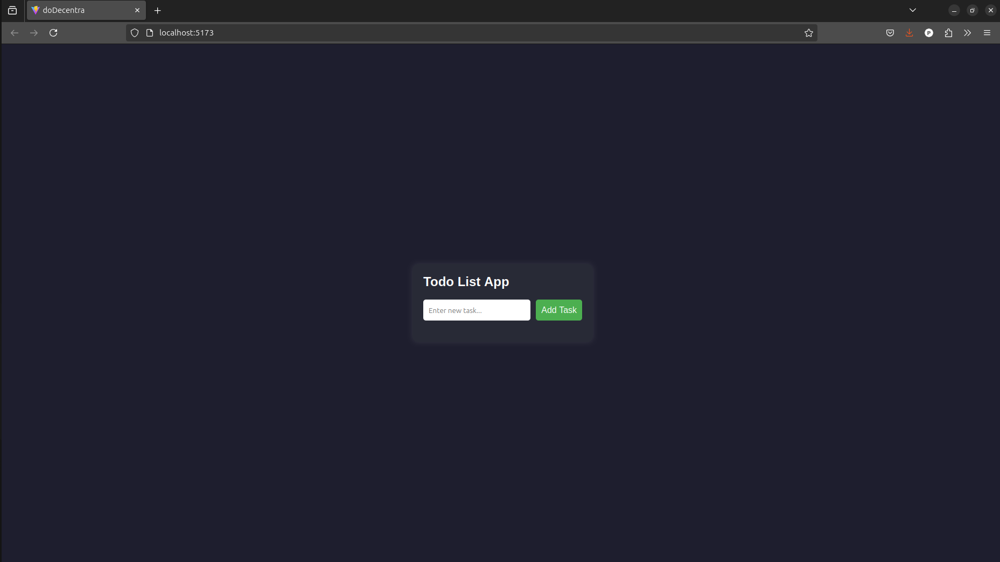

# ✅ doDecentra – A Decentralized To-Do List  

**doDecentra** is a **decentralized To-Do List DApp** built using **Solidity, React, Ethers.js**, and **Hardhat**. It allows users to **add and remove tasks** while interacting with the blockchain using **MetaMask**.

---

## 🚀 Features  

✅ **Decentralized** – Your tasks are stored on the Ethereum blockchain.  
✅ **MetaMask Integration** – Sign transactions securely using MetaMask.  
✅ **Smart Contract Powered** – Tasks are managed through a Solidity smart contract.  
✅ **User-Friendly UI** – A clean and interactive interface.  

---

## 🛠️ Installation & Setup  

### 📌 1. Clone the Repository  

```sh
git clone https://github.com/amartya-pandey/doDecentra.git
cd doDecentra
```

---

### 📌 2. Install Dependencies  

```sh
npm install
```

---

### 📌 3. Start a Local Blockchain (Using Hardhat)  

```sh
npx hardhat node
```

This will start a local blockchain at **http://127.0.0.1:8545**.

---

### 📌 4. Deploy the Smart Contract  

Run the following command to deploy the smart contract to the local Hardhat network:

```sh
npx hardhat run scripts/deploy.js --network localhost
```

**Copy the deployed contract address** from the output.

---

### 📌 5. Configure `blockchain.js`  

Edit `blockchain.js` and **replace the contract address** with the one from the deployment step.

```javascript
const CONTRACT_ADDRESS = "YOUR_DEPLOYED_CONTRACT_ADDRESS"; // Replace this
```

---

### 📌 6. Connect MetaMask to Hardhat  

1. Open **MetaMask** and go to **Settings > Networks > Add Network**.  
2. Click **Add a network manually** and enter:  
   - **Network Name:** Hardhat  
   - **RPC URL:** `http://127.0.0.1:8545`  
   - **Chain ID:** `31337`  
   - **Currency Symbol:** ETH  

3. Import a Hardhat test account:  
   - In your terminal, find a test private key from `npx hardhat node`.  
   - Go to **MetaMask > Import Account**, and paste the private key.

---

### 📌 7. Start the Frontend  

```sh
npm run dev
```

Open **http://localhost:5173/** in your browser.   



---

## 🖥️ Usage  

1. **Connect MetaMask**  
   - Click **"Connect Wallet"** to link MetaMask.  
   
2. **Add a Task**  
   - Enter a task and click **"Add Task"**.  
   - MetaMask will prompt you to confirm the transaction.  

3. **Remove a Task**  
   - Click **"Remove"** next to a task.  
   - Confirm the transaction in MetaMask.  

4. **Tasks Persist on Blockchain**  
   - Refresh the page and your tasks remain **on-chain**.  

---

## 📜 Smart Contract  

The smart contract is located at:  

📁 `contracts/TodoContract.sol`  

It includes:  
- `addTask(string memory _task)` – Adds a new task.  
- `getTasks()` – Retrieves all tasks.  
- `removeTask(uint256 _index)` – Removes a task.  

---

## 📖 Additional Guide  

For detailed instructions on connecting MetaMask, see:  
📄 [**ConnectMetaMask.md**](./ConnectMetaMask.md)  

---

## 🛠️ Tech Stack  

🔹 Solidity  
🔹 Hardhat  
🔹 React  
🔹 Ethers.js  
🔹 MetaMask  

---

## 🤝 Contributing  

Contributions are welcome! Fork the repo, make changes, and submit a PR.  

---

## 📄 License  

This project is **open-source** under the MIT License.  
